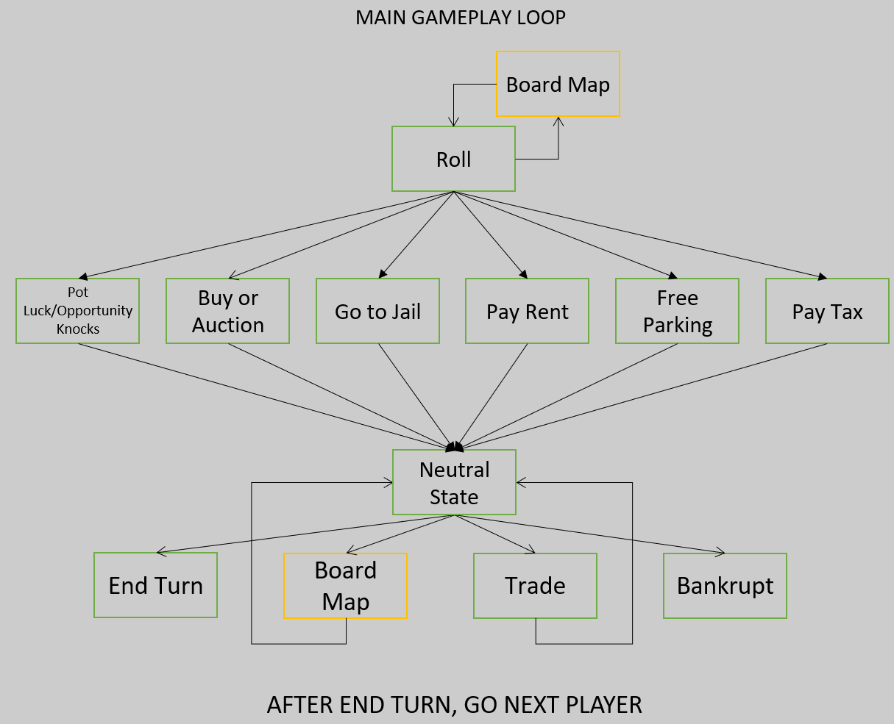
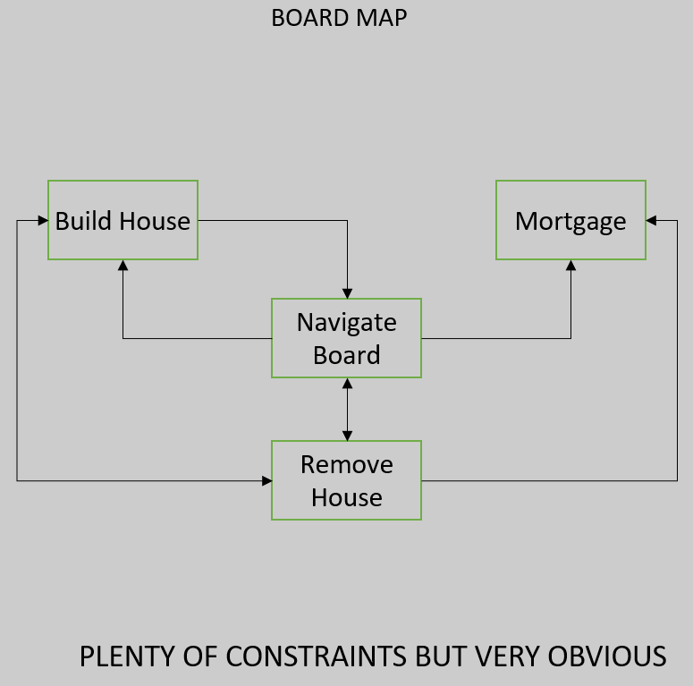
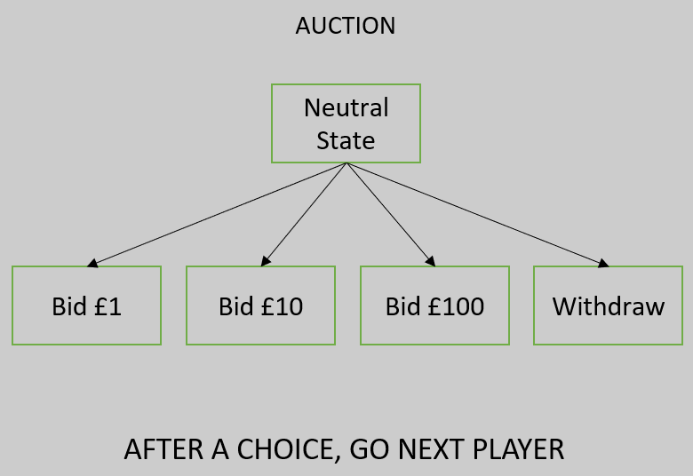
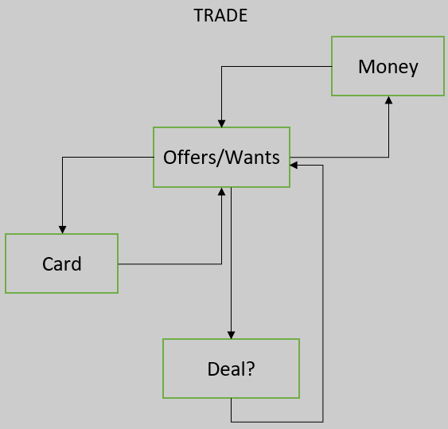

<h1>Main Gameplay Loop</h1>

The game of Property Tycoon, like most games, has a main gameplay loop which kind of defines the game, it is the structure upon the game is played and experienced on. This file will discuss the in-game gameplay loop, I might make one for the menus.

The best place to start for getting an understanding of what the main gameplay loop may look like was the monopoly ps4 version as it is the closest thing to what we're looking to achieve with our creation of Property Tycoon. I had searched YouTube for a video of someone playing said monopoly ps4 game and skimming through to see how the game progresses and what options are available when. I used the video: "https://www.youtube.com/watch?v=lcJFecoMhCo".

<h2>The Rough Main Gameplay Loop I have Designed</h2>
 

A player starts with the options to either roll the dice or view the board map. The reason I have the board map option with a yellow outline is because this is the case in the video, however I am not sure if we will be including such an option for a range of reason, e.g. Our implementation makes the option of viewing the board map irrelevant.

The arrows are important here as it shows that as soon as you roll the dice you temporarily lose the option to view the board map, this is important as the board map option actually has it's own set of options, however I display this in another image.

Once the dice are rolled we see there are many options that are available, this is because it models all the possible outcomes of the tile that you land on, you can land on a property, which leads to the "buy or auction" or "Pay Rent" options, depending on the status of the property, you can land on either "Go to Jail" or "Free Parking" corner, you can land on a "Pay Tax" tile or a "Pot Luck/Opportunity Knocks" tile.

yo this is a change

Coincidently they all progress to the same next state, the "Neutral" state. This state is only for visual purposes and hint the name doesn't itself invoke an action. From this neutral state the player can once again access the board map as well as trade with other players or declare bankruptcy. Once again paying attention to the arrows, the player can go back and forth between trading and the board map but once they choose either "Bankrupt" or "End Turn" options their turn will end. The statement at the bottom is to show that once the player chooses "End Turn" or "Bankrupt" this loop will start again however the player's whose turn it was next will now go.

<h2>Board Map Loop</h2>
 

As I stated above, the board map option available in the main gameplay loop also has it's own set of options, this is also true for the "Trade" and auction part of the "Buy or Auction" option. Once again the loop once in the board map was taken from the same video as stated above.

The "Navigate Board" option acts as a neutral state although it is possible to act without changing states, from navigating the board it is possible to either, build a house, remove a house or mortgage a house. Reminder that this is a rough design and so the statement below just serves to help understand that the design above is simplified as there are many constraints that are present.

<h3 style = "color:#ff8080">Problem</h3>
An example of a situation that isn't detailed too well by the design is a property that doesn't have a house, why would there be an option to remove a house from navigating the board as the design suggests, it has the option to remove a house from the navigation board for the situation where there is a house to remove.

Despite the problem of not representing some situations very well I do believe the design to be useful as it is simplistic and accounts for the far majority of the situations possible.

<h2>Auction Loop</h2>

The auction loop is a lot more simple than the ones previous, once again from a neutral state the player will choose to either bid, £1, £10 or £100 to try and secure the property or withdraw to pass it on to someone else. Once again the statement at the bottom states that after either of the said options are chosen the loop is then repeated for the players whose next turn it is.

There is possibility for a "Sold" state however I do believe that it well-known how said state is reached as well as "Sold" not really being an option they can choose rather than forced into.

<h2>Trade Loop</h2>

The current design for the trade loop, as seen above, is somewhat awkward to view. I think everyone understands that when a trade occurs a player will show what they are willing to give for what they desire. Since both "giving" and "receiving" are comprised of the same thing, cards and money, I decided to have them as one state, remembering that I have based this off the YouTube video I linked above this single state design does make sense as you are able to go back and forth between "offering" and "receiving".

The last thing to mention is the "Deal?" state, once you have declared what you are offering and what you are receiving the player who is being traded with can decide whether to accept the proposed deal, in which case "Deal?" is a terminal state, or propose a counter offer, starting the offer/want loop again.
